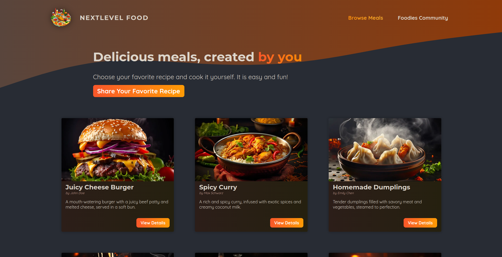

<h1>Next Level Foods</h1>
<h4>
    é uma plataforma desenvolvida utilizando Next.js e sqLite3, que permite aos usuários compartilharem suas receitas favoritas e descobrirem novos pratos deliciosos. A aplicação visa criar uma comunidade de entusiastas da culinária, promovendo a troca de experiências e inspirando a criatividade na cozinha.
</h4>

<h4>Funcionalidades:</h4>

<strong>Cadastro de Receitas:</strong> Os usuários podem criar e compartilhar suas próprias receitas, incluindo ingredientes, passo a passo e fotos atraentes.

<strong>Exploração de Receitas:</strong> Navegue por uma variedade de receitas categorizadas e descubra pratos novos e emocionantes.

<strong>Contato com o criador da receita:</strong> é possível entrar em contato com o dono da receita via e-mail.

<h3>Como Executar a Aplicação:</h3>

Siga os passos abaixo para executar o projeto localmente:

 

<h4>Pré-requisitos</h4>

Certifique-se de ter o Node.js instalado em sua máquina.

 

<h4>Passos</h4>

 

<strong>Clone o Repositório:</strong>

https://github.com/DilleyAndrade/food-lovers.git

 

<strong>Instale as Dependências:</strong>

npm install

 

<strong>Inicie a Aplicação:</strong>

npm run dev

 

<strong>Acesse a Aplicação:</strong>

Abra seu navegador e acesse http://localhost:3000.

Agora, você deve ter a aplicação em execução localmente em seu ambiente de desenvolvimento.

<h4>Contribuições</h4>

  Contribuições são bem-vindas! Se você deseja melhorar ou adicionar novos recursos, sinta-se à vontade para enviar um email para mim em dilleyandrade@gmail.com.

<h4>Licença</h4>

Este projeto é licenciado sob a Licença MIT.

Espero que desfrute da experiência de compartilhar e descobrir novos sabores! Se encontrar problemas ou tiver sugestões, não hesite em abrir uma issue no repositório.

